# Anglesite Architecture

Anglesite is a local-first, Electron-based static site generator that combines Eleventy's powerful site generation with a native desktop application experience. This document describes the current architecture and design decisions.

## System Overview

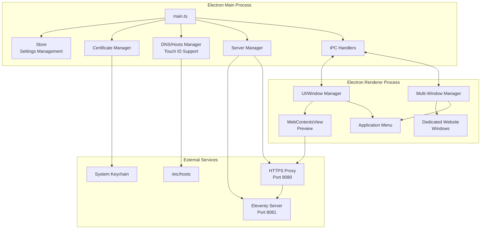

## Directory Structure

```text
anglesite/
├── app/                        # Electron application source
│   ├── main.ts                 # Main process entry point
│   ├── preload.ts              # Preload script for renderer
│   ├── renderer.ts             # Renderer process code
│   ├── index.html              # Main window HTML
│   ├── styles.css              # Application styles
│   ├── store.ts                # Persistent settings storage
│   ├── certificates.ts         # CA and SSL certificate management
│   │
│   ├── dns/                    # DNS management
│   │   └── hosts-manager.ts    # /etc/hosts file management
│   │
│   ├── server/                 # Server components
│   │   ├── eleventy.ts         # Eleventy server management
│   │   ├── https-proxy.ts      # HTTPS proxy server
│   │   ├── per-website-server.ts # Individual website server instances
│   │   └── index.ts            # Server module exports
│   │
│   ├── ui/                     # User interface components
│   │   ├── window-manager.ts   # Window and WebContentsView management
│   │   ├── multi-window-manager.ts # Multi-window architecture
│   │   ├── menu.ts             # Application menu with context awareness
│   │   ├── template-loader.ts  # Data URL template loading system
│   │   ├── theme-manager.ts    # Dynamic dark/light mode theming
│   │   ├── templates/          # HTML template files
│   │   │   ├── bagit-metadata.html    # BagIt metadata collection form
│   │   │   ├── input-dialog.html      # Native input dialog template
│   │   │   ├── preview-fallback.html  # Preview error fallback
│   │   │   ├── settings.html          # Settings window template
│   │   │   ├── website-selection.html # Website selection interface
│   │   │   └── welcome-assistant.html # First-time setup wizard
│   │   ├── first-launch.html   # First launch assistant (legacy)
│   │   └── index.ts            # UI module exports
│   │
│   ├── ipc/                    # Inter-process communication
│   │   └── handlers.ts         # IPC message handlers
│   │
│   ├── utils/                  # Utility functions
│   │   └── website-manager.ts  # Website creation/management
│   │
│   └── eleventy/               # Eleventy configuration
│       ├── .eleventy.js        # Eleventy config
│       ├── includes/           # Layout templates (legacy)
│       └── src/                # Website template source
│           ├── index.md        # Default homepage template
│           ├── 404.md          # Error page template
│           └── _includes/      # Eleventy templates
│               ├── base-layout.njk
│               ├── header.njk
│               └── style.css
│
├── dist/                       # Compiled output
│   ├── app/                    # Compiled TypeScript
│   └── [site files]            # Built static site
│
├── docs/                       # Project documentation
├── test/                       # Test files
│   ├── ui/                     # UI component tests
│   ├── ipc/                    # IPC handler tests
│   ├── integration/            # Integration tests
│   └── dns/                    # DNS management tests
├── types/                      # TypeScript type definitions
│   └── bagit-fs.d.ts          # BagIt library types
├── bin/                        # Legacy shell scripts
└── package.json                # Dependencies and scripts
```

## Core Components

### 1. Application Initialization Flow

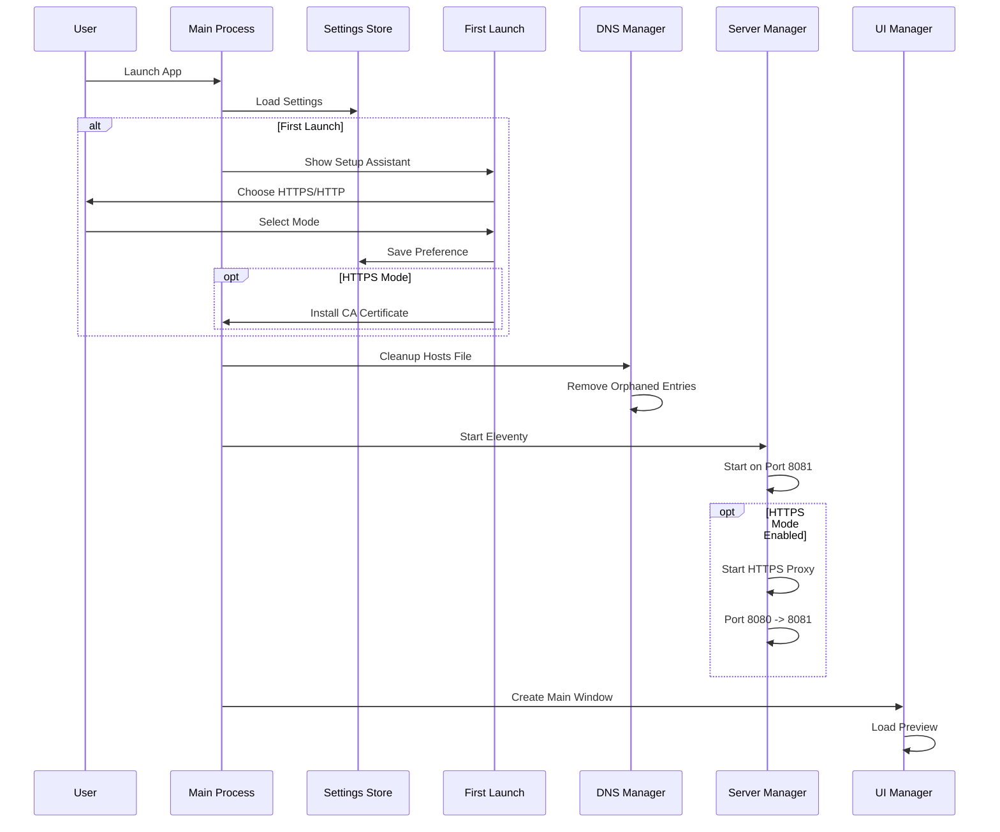

### 2. Certificate Management

The certificate system uses the `mkcert` npm package to generate trusted SSL certificates:

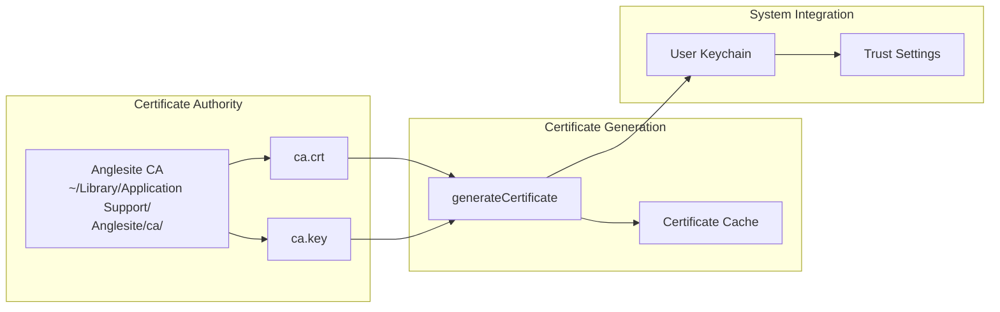

**Key Features:**

- Self-contained CA generation
- Certificate caching for performance
- User keychain installation (no admin required)
- Fallback to HTTP if certificate issues

### 3. DNS and Hosts Management with Biometric Authentication

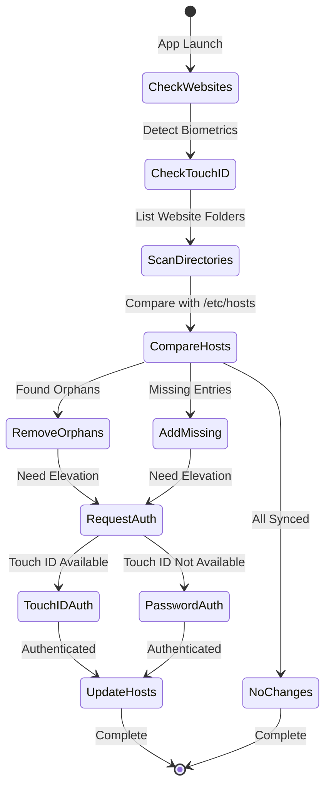

**Enhanced Authentication System:**

- **Touch ID Support**: Native biometric authentication on supported macOS systems
- **Fallback Authentication**: Password prompt when Touch ID unavailable
- **Privilege Detection**: Uses `native-is-elevated` to check current permissions
- **Secure Elevation**: `sudo-prompt` integration for administrator access

**Automatic Management:**

- Scans `~/Library/Application Support/Anglesite/websites/`
- Maintains Anglesite section in `/etc/hosts`
- Removes orphaned .test domains
- Adds new website domains automatically
- Preserves system entries outside Anglesite section
- Single authentication prompt for batch operations

### 4. Multi-Window Architecture

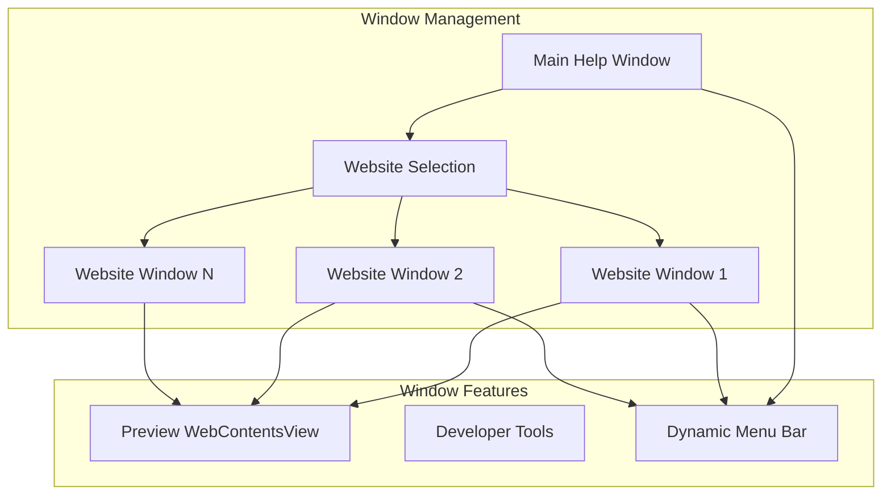

**Key Features:**

- **Dedicated Website Windows**: Each website opens in its own isolated window
- **Context-Aware Menus**: Menu bar adapts based on focused window type
- **Independent Preview**: Each website window has its own WebContentsView
- **Window State Management**: Tracks open websites and prevents duplicates
- **Seamless Editing Workflow**: Direct website creation and editing flow
- **Individual Server Instances**: Each window runs its own Eleventy dev server
- **Window State Persistence**: Window positions and open websites restored on app restart
- **Server Lifecycle Management**: Automatic server cleanup on window close

### 5. Template System Architecture

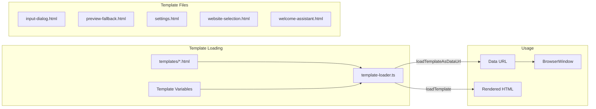

**Key Features:**

- **Variable Substitution**: Replace {{variableName}} placeholders with dynamic values
- **Data URL Support**: Convert templates to data URLs for BrowserWindow loading
- **Centralized Templates**: All HTML templates stored in ui/templates directory
- **Error Handling**: Graceful fallback when templates are missing

### 6. Dark Mode and Theme Management

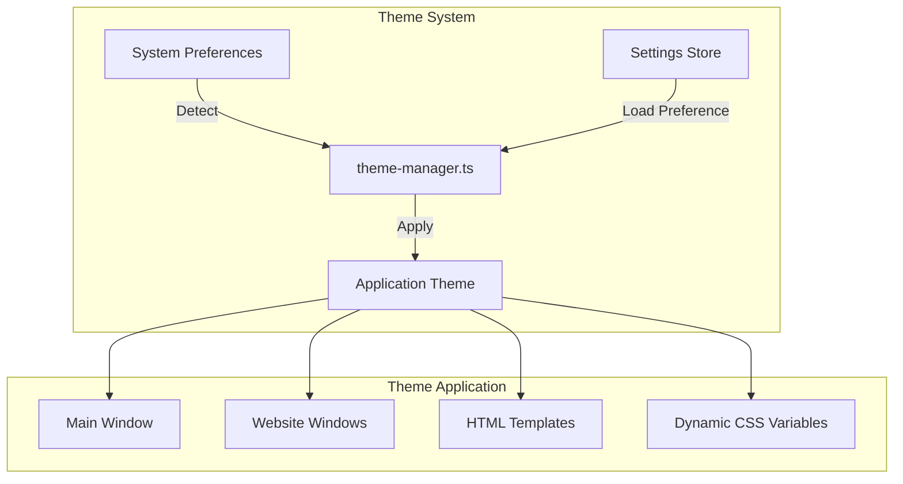

**Dark Mode Features:**

- **System Integration**: Follows macOS dark mode preference
- **Dynamic Theming**: Real-time theme switching without restart
- **Comprehensive Coverage**: Themes apply to all windows, menus, and templates
- **CSS Variables**: Uses CSS custom properties for consistent theming
- **Toolbar Integration**: Native toolbar follows theme changes

### 7. Website Management

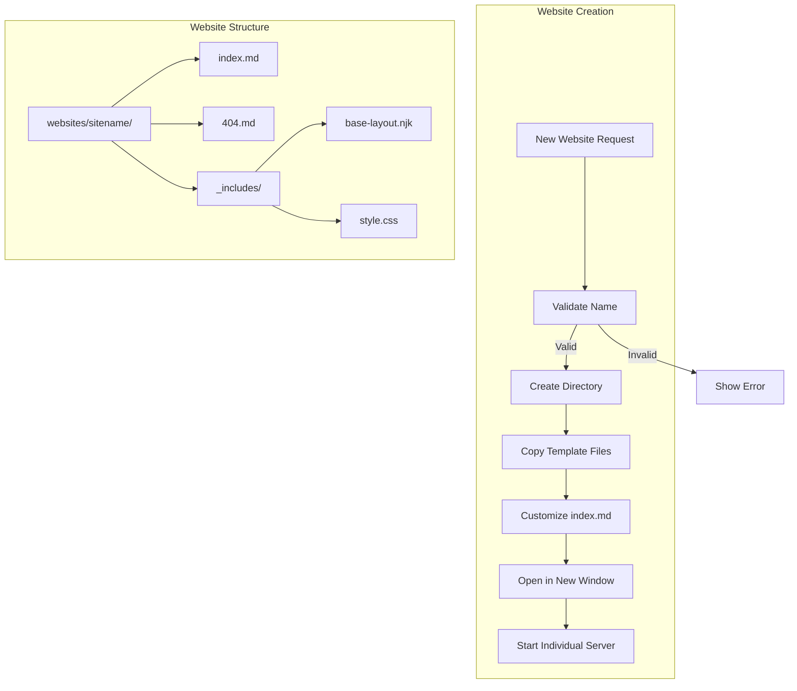

### 8. Server Architecture

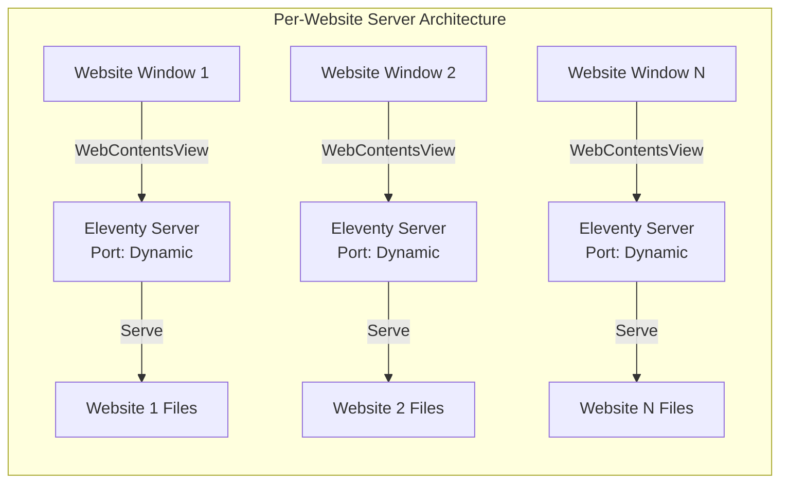

**Individual Server Instances:**

- **Per-Website Servers**: Each website window runs its own Eleventy server instance
- **Dynamic Port Allocation**: Automatically finds available ports for each server
- **Independent Building**: Each server builds to its own temporary directory
- **Hot Reload**: File watching and live reload per website
- **Resource Cleanup**: Servers stop when windows close, temp directories cleaned

## Data Flow

### IPC Communication

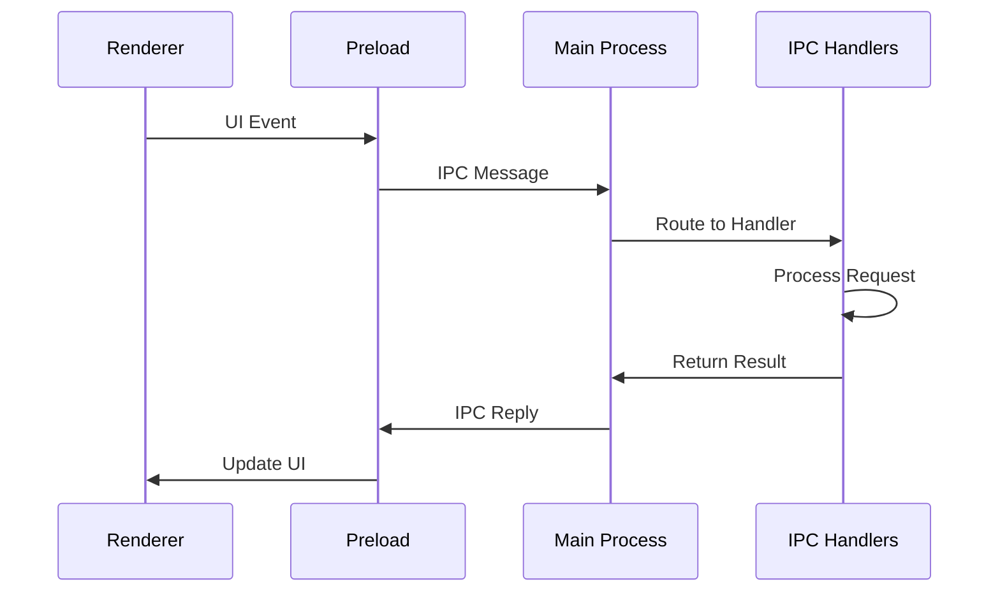

**Key IPC Channels:**

- `new-website`: Create new website with validation
- `list-websites`: Get available websites (excluding open ones)
- `open-website`: Open website in dedicated window
- `validate-website-name`: Real-time name validation
- `rename-website`: Rename existing website
- `delete-website`: Delete website with confirmation
- `export-site`: Export website (folder, ZIP, or BagIt format)
- `preview`: Show preview window
- `toggle-devtools`: Toggle developer tools
- `build`: Trigger site build
- `open-browser`: Open in external browser
- `reload-preview`: Reload preview content
- `toggle-preview-devtools`: Toggle preview dev tools
- `show-website-context-menu`: Display right-click menu
- `get-theme`: Get current theme setting
- `set-theme`: Update theme preference
- `bagit-metadata-result`: BagIt metadata collection
- `input-dialog-result`: Native input dialog responses

## Security Architecture

### Certificate Trust Model

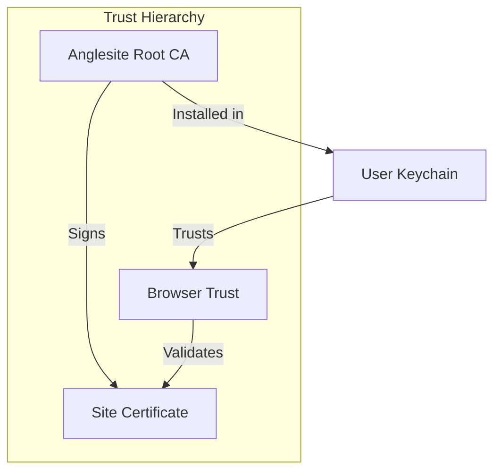

### Permission Model

1. **File System Access**
   - Application data: `~/Library/Application Support/Anglesite/`
   - Website storage: Isolated in app data
   - No access to user documents without explicit action

2. **Network Security**
   - Local-only servers (127.0.0.1)
   - No external network access
   - HTTPS certificates for .test domains only

3. **System Integration**
   - Hosts file modification with biometric authentication (Touch ID)
   - Fallback to password authentication when biometrics unavailable
   - Certificate installation in user keychain
   - Privilege escalation using `sudo-prompt` (replaces electron-sudo)
   - No system-wide changes without explicit consent

## State Management

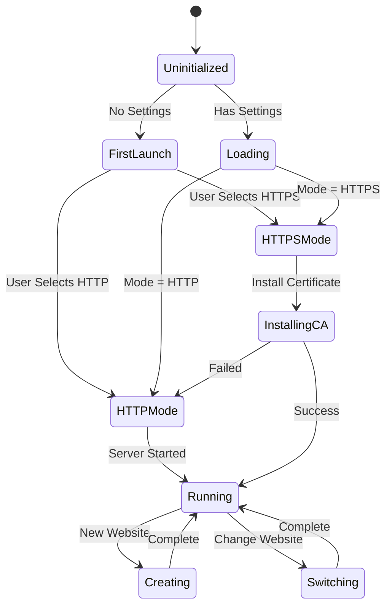

## Performance Optimizations

1. **Certificate Caching**
   - In-memory cache for generated certificates
   - Avoids regenerating for same domains

2. **Lazy Loading**
   - WebContentsView created once, reused
   - Eleventy server persists between site switches

3. **Hosts File Management**
   - Batch operations for multiple domains
   - Single biometric/password prompt for all changes
   - Intelligent privilege checking with `native-is-elevated`
   - Touch ID detection and user guidance

4. **Multi-Window Optimization**
   - Window state tracking prevents duplicate windows
   - Context-aware menu updates
   - Efficient WebContentsView reuse

## Future Architecture Considerations

### Planned Improvements

1. **Plugin System**
   - Extensible Eleventy configurations
   - Custom build pipelines
   - Third-party integrations

2. **Multi-Site Management** ✅ _Fully Implemented_
   - ✅ Concurrent site editing (multi-window architecture)
   - ✅ Individual server instances per website
   - ✅ Site templates with customization
   - ✅ Export functionality (folder, ZIP, BagIt)
   - ✅ Window state restoration
   - ✅ Dynamic port allocation
   - ✅ Independent build directories

3. **Deployment Integration**
   - Direct deploy to hosting services
   - Git integration
   - CI/CD pipeline support

### Scalability Considerations

- **Website Limit**: Currently unlimited (filesystem constrained)
- **Performance**: Handles 100+ websites efficiently
- **Memory Usage**: ~150MB baseline, scales with preview content
- **Certificate Management**: Cached, 365-day validity
- **BagIt Export**: Metadata collection with structured archival format
- **Multi-Window State**: Persistent window restoration across app restarts

### 9. Export System Architecture

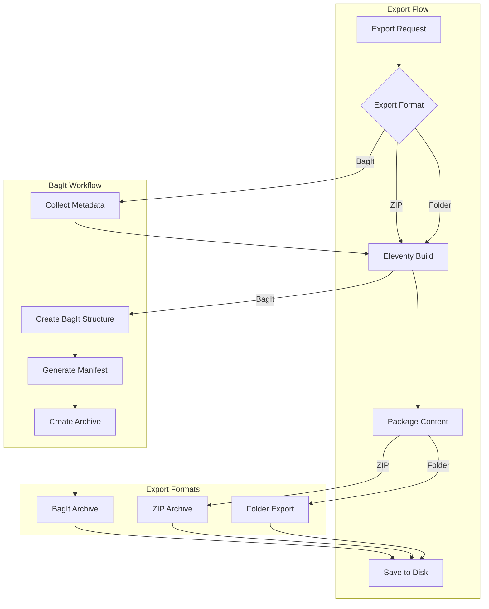

**Export Features:**

- **Multiple Formats**: Folder, ZIP, and BagIt archival format support
- **Metadata Collection**: Interactive form for BagIt metadata (Dublin Core)
- **Build Integration**: Automatic Eleventy build before export
- **Progress Feedback**: Real-time export progress indicators
- **Error Handling**: Graceful failure recovery with user notifications

### 10. Code Quality and Type Safety

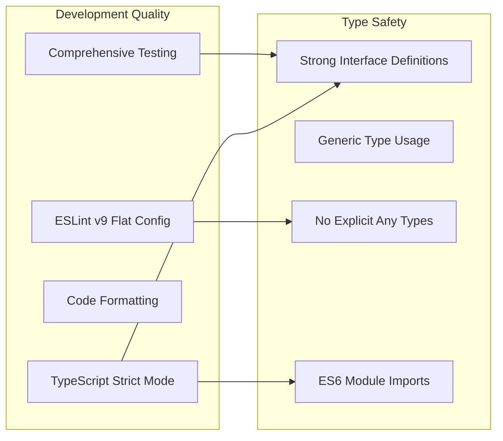

**Quality Standards:**

- **Zero ESLint Violations**: Strict adherence to coding standards
- **Type Safety**: No `any` types, proper function signatures
- **Module System**: ES6 imports throughout, dynamic imports for circular dependencies
- **Test Coverage**: Comprehensive unit and integration test suite
- **Mock Architecture**: Sophisticated mocking for Electron APIs

## Technology Stack

### Core Dependencies

- **Electron**: Desktop application framework (>=32.0.0)
- **Eleventy (@11ty/eleventy)**: Static site generator engine
- **TypeScript**: Type-safe development with strict mode
- **Jest**: Testing framework with comprehensive mocking and jsdom
- **ESLint v9**: Modern flat configuration with TypeScript support
- **Prettier**: Code formatting with consistent style

### Authentication & Security

- **sudo-prompt**: Secure privilege escalation with Touch ID support
- **native-is-elevated**: Cross-platform privilege detection
- **hostile**: Cross-platform hosts file management
- **mkcert**: Trusted SSL certificate generation

### Export & Archival

- **archiver**: ZIP file creation for export functionality
- **bagit-fs**: BagIt digital preservation format support
- **fs-extra**: Enhanced file system operations

### UI & Window Management

- **WebContentsView**: Modern preview integration
- **BrowserWindow**: Multi-window architecture
- **IPC**: Secure inter-process communication
- **Template System**: Data URL-based HTML template loading
- **Theme Manager**: Dynamic dark/light mode with CSS variables

## Development Workflow

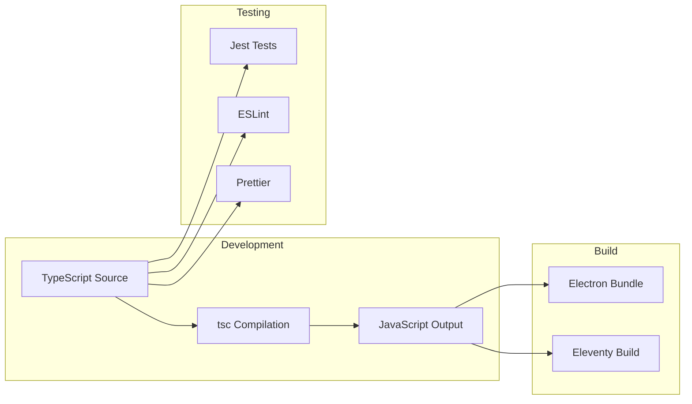

## Recent Improvements

### Bug Fixes and Stability

- **Fixed V8 Engine Crashes**: Resolved memory access violations in window management
- **Fixed App Shutdown Crashes**: Proper cleanup of file watchers (fsevents) on quit
- **Fixed Eleventy Output Conflicts**: Prevented duplicate index.html/index.md issues
- **Fixed BagIt Export**: Corrected file path handling and directory creation
- **Fixed Preview Template**: Improved build log display and error state persistence

### Performance Enhancements

- **Server Isolation**: Each website runs in its own server instance
- **Dynamic Port Management**: Automatic port allocation prevents conflicts
- **Optimized File Watching**: Proper watcher cleanup prevents resource leaks
- **Template Caching**: Improved template loading with data URL conversion

## Conclusion

Anglesite's architecture prioritizes:

- **Simplicity**: Minimal configuration, works out of the box
- **Security**: Sandboxed, local-only, user-controlled
- **Performance**: Efficient resource usage, fast preview updates
- **Reliability**: Robust error handling and graceful degradation
- **Scalability**: Multi-window, multi-server architecture
- **Extensibility**: Modular design allows for future growth

The architecture successfully balances the power of Eleventy with the convenience of a desktop application, providing a seamless local development experience for static sites with enterprise-grade stability and performance.
