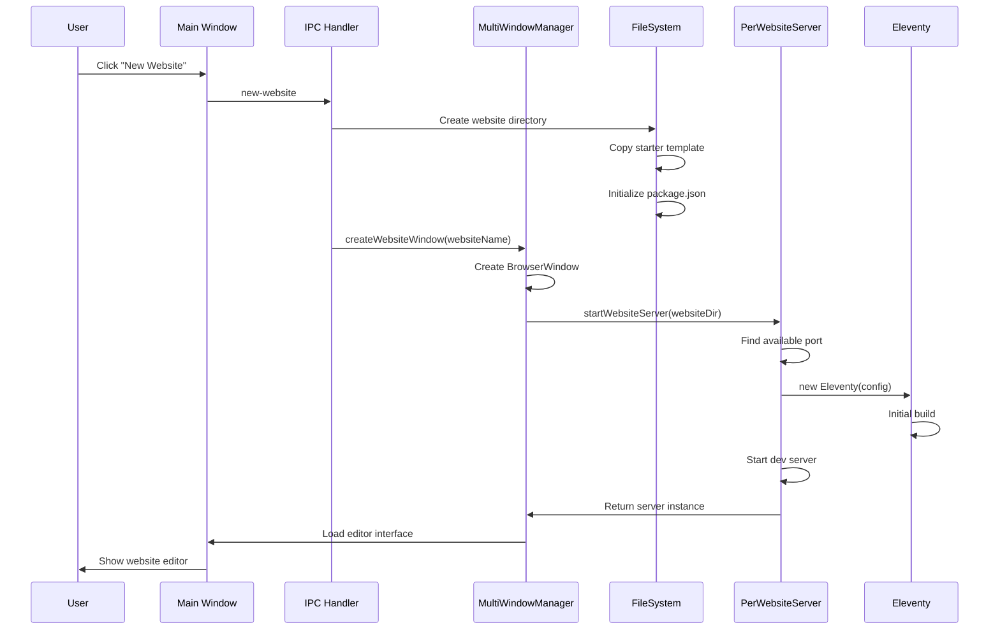
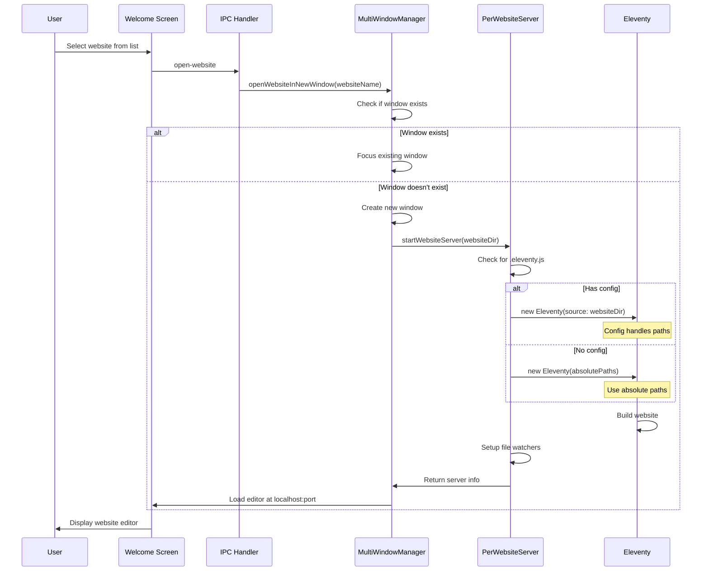
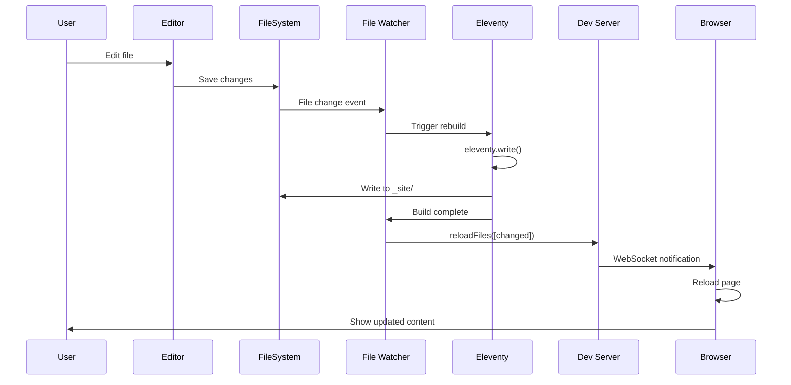

# Website Editor

## Overview

Anglesite supports editing multiple websites simultaneously through a multi-window architecture. Each website gets its own dedicated editor window with an isolated Eleventy development server instance. This ensures complete separation between projects while maintaining optimal performance.

## Architecture

### Directory Structure

Each website is stored in its own directory within the application's data folder:

```text
[OS-App-Directory]/websites/
  ├── website-1/
  │   ├── src/           # Source files (markdown, templates, etc.)
  │   ├── _site/         # Build output directory
  │   ├── .eleventy.js   # Eleventy config
  │   └── package.json   # Node dependencies
  ├── website-2/
  └── website-3/
```

### Core Components

#### 1. Multi-Window Manager (`app/ui/multi-window-manager.ts`)

- Manages the lifecycle of all website editor windows
- Tracks window states and associated servers
- Handles window creation, restoration, and cleanup
- Maintains a map of website names to their window instances

#### 2. Per-Website Server (`app/server/per-website-server.ts`)

- Creates isolated Eleventy instances for each website
- Manages individual development servers on unique ports
- Handles file watching and live reload independently
- Supports both configured and unconfigured websites

#### 3. Eleventy Integration (`app/server/eleventy.ts`)

- Handles .test domain generation for websites
- Contains shared utilities for server management

## Website Isolation

### Process Isolation

Each website runs in its own context with:

- **Dedicated Eleventy Instance**: Each website gets its own `Eleventy` object
- **Separate Dev Server**: Individual `EleventyDevServer` instance per site
- **Unique Port Allocation**: Dynamic port assignment starting from 8082
- **Independent File Watching**: Isolated file system watchers per website

### Path Resolution

The system uses absolute paths to prevent conflicts:

- No `process.chdir()` calls that would affect the global process
- Absolute path resolution for all file operations
- Config files resolved relative to their website directory
- The `source` option tells Eleventy the project root for relative paths

### Configuration Handling

Anglesite requires websites to have an `.eleventy.js` configuration file:

- Config specifies `input: 'src'` relative to website root
- System passes `source: websiteDir` to Eleventy
- All paths in config resolved from that source

## Sequence Diagrams

### Creating a New Website



### Opening an Existing Website



### File Change Detection and Rebuild



## Server Management

### Port Allocation

The system dynamically allocates ports for each website:

1. First website: Port 8081
2. Subsequent websites: Next available port (8082, 8083, etc.)

Port allocation algorithm:

```javascript
function findAvailablePort(startPort: number): Promise<number> {
  // Check if port is available
  // If not, increment and try again
  // Return first available port
}
```

### Server Lifecycle

1. **Startup**:
   - Create Eleventy instance with proper configuration
   - Perform initial build
   - Start development server on allocated port
   - Setup file watchers for hot reload

2. **Runtime**:
   - Monitor file changes in website directory
   - Trigger rebuilds on changes
   - Manage WebSocket connections for live reload
   - Send build logs to website window

3. **Shutdown**:
   - Stop file watchers
   - Close development server
   - Clean up Eleventy instance
   - Release allocated port

## Error Handling

### Build Errors

- Errors are caught and logged to the website window
- Full stack traces sent for debugging
- Window remains open for error correction
- Server continues running for recovery

### Path Resolution Errors

- Verify all directories exist before use
- Provide clear error messages for missing directories
- Fall back to sensible defaults when possible

### Configuration Errors

- Validate `.eleventy.js` before loading
- Handle missing or invalid configurations gracefully
- Use default settings when config is unavailable

## Performance Considerations

### Resource Management

- Each website uses approximately 50-100MB RAM
- File watchers limited to website directory only
- Build processes run independently without blocking
- Unused servers can be stopped to free resources

### Scalability

- Tested with up to 10 simultaneous websites
- Port range supports up to 100 websites (8082-8181)
- Window state persisted for quick restoration
- Lazy loading of servers on window focus

## Security

### Isolation Boundaries

- Each website runs in its own directory sandbox
- No cross-website file access
- Separate Node module contexts
- Independent build processes

### Network Security

- Servers bound to localhost only
- Optional HTTPS proxy for secure preview
- WebSocket connections authenticated per window
- No external network access by default

## Future Enhancements

1. **Docker Container Support**: Run each website in an isolated container
2. **Remote Development**: Connect to websites on remote servers
3. **Collaborative Editing**: Multiple users editing the same website
4. **Build Optimization**: Incremental builds and caching
5. **Plugin Marketplace**: Easy installation of Eleventy plugins
6. **Version Control Integration**: Built-in Git operations per website
